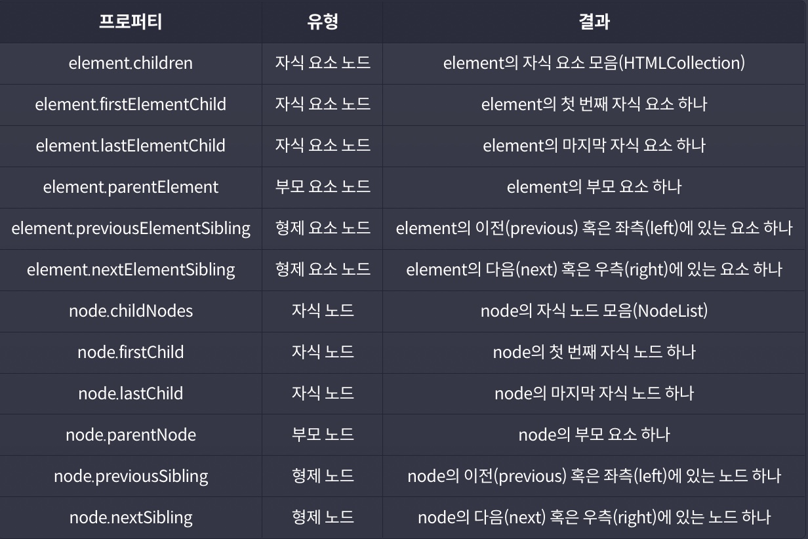
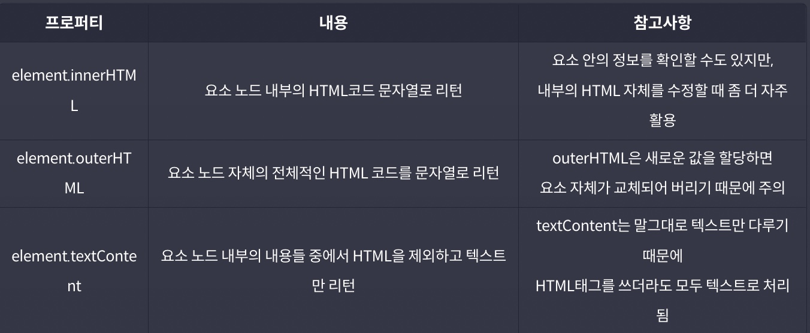
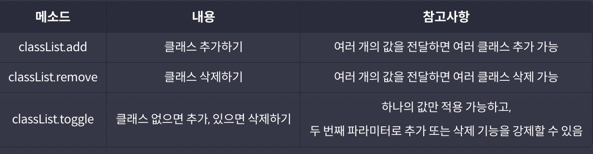

# 브라우저와 자바스크립트

## window 객체

`window` 객체는 브라우저 창을 대변하면서 자바스크립트에서 최상단에 존재하는 객체.
자바스크립트 코드 어느 곳에서나 항상 접근할 수 있는 객체이기 때문에 전역 객체, 영어로는 Global Object라고 부른다.
어떤 프로퍼티나 메소드를 사용하든 결국 전역 객체 내부의 것이기 때문에 앞에 `window.`을 생략할 수도 있다.

## DOM

`DOM`이란 `Document Object Model`의 약자로, 한국어로는 문서 객체 모델.
간단하게 표현하면 **웹 페이지에 나타나는 HTML 문서 전체를 객체로 표현한 것**으로 생각하면 된다.
이때 **각 객체를 `노드`(Node)라는 용어로 표현하고, 태그는 요소 노드, 문자는 텍스트 노드로 구분**된다.

## DOM 트리

**HTML의 계층 구조는 DOM에서도 반영되는데 이러한 계층구조를 나무에 비유해서 DOM 트리**라고 부른다.
각 노드 간의 관계는 부모, 자식, 형제라는 용어로 표현.

## DOM 이동 시 활용 가능한 프로퍼티

## 주요 요소 노드 프로퍼티

## 요소 노드 다루기

1. 요소 노드 만들기: `document.createElement('태그이름')`
2. 요소 노드 꾸미기: `element.textContent`, `element.innerHTML`, ...
3. 요소 노드 추가 혹은 이동하기: `element.prepend`, `element.append`, `element.after`, `element.before`
4. 요소 노드 삭제하기: `element.remove()`

## HTML 속성 다루기

대부분의 HTML 속성은 DOM 객체의 프로퍼티로 변환이 된다.
하지만, 표준 속성이 아닌 경우에는 프로퍼티로 변환이 안 되는데, 아래 메소드를 활용하면 표준이 아닌 HTML 속성들도 다룰 수 있다.

1. 속성에 접근하기: `element.getAttribute('속성')`
2. 속성 추가(수정)하기: `element.setAttribute('속성', '값')`
3. 속성 제거하기: `element.removeAttribute('속성')`

## 스타일 다루기

자바스크립트로 태그의 스타일을 다루는 방법에는 크게 두 가지가 있다.

1. style 프로퍼티 활용하기: `element.style.styleName = 'value';`
2. class 변경을 통해 간접적으로 스타일 적용하기: `element.className`, `element.classList`

### classList의 유용한 메소드

