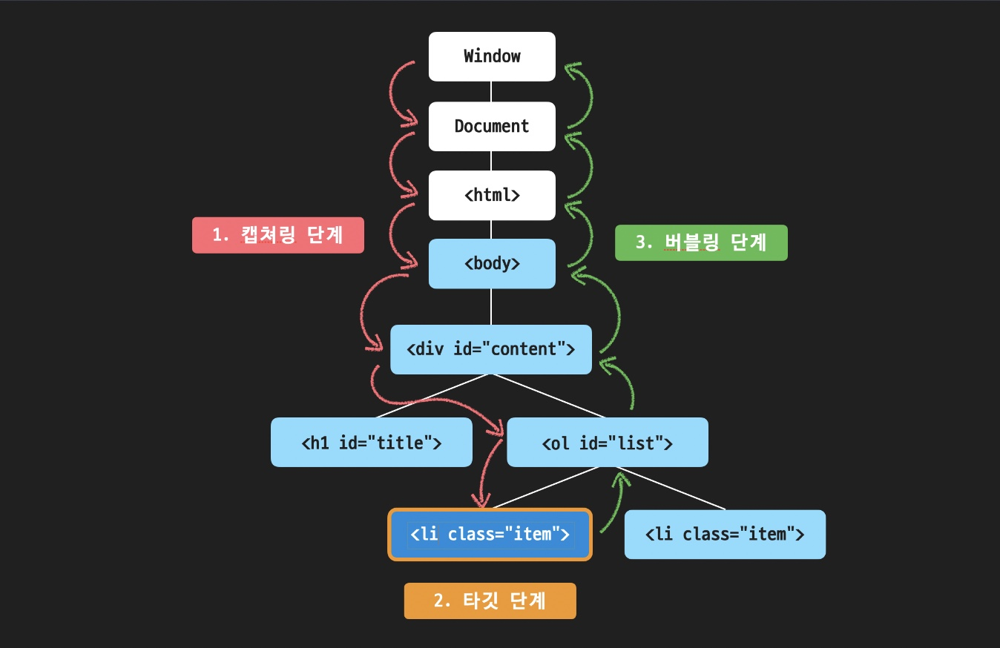

# 이벤트

## 다양한 이벤트

### 마우스 이벤트


### 키보드 이벤트


### 포커스 이벤트


### 입력 이벤트


### 스크롤 이벤트

`scroll` : 스크롤바가 움직일때

### 윈도우 창 이벤트

`resize` : 윈도우 사이즈를 움질일때 발생

## 이벤트 핸들러 등록하기

HTML의 속성이나 DOM 프로퍼티를 활용해 이벤트를 등록하는 방법 외에 `Element.addEventListener('type', 'handler')`를 통해서 이벤트 핸들러를 등록할 수 있다.

## 이벤트 핸들러 삭제하기

`addEventListener` 메소드를 활용해서 이벤트 핸들러를 등록했다면, `Element.removeEventListner('type', 'handler')`를 통해서 이벤트 핸들러를 삭제할 수 있다.

## 이벤트 객체 (Event Object)

이벤트가 발생하면 이벤트 핸들러의 첫 번째 파라미터에는 자동으로 이벤트 객체가 전달된다.

이벤트 객체는 이벤트 종류마다 가지고 있는 프로퍼티가 다르며, 이벤트에 대한 유용한 정보들을 프로퍼티로 가지고 있습니다.

아래는 자주 사용되는 프로퍼티들이며 이 밖에도 다양한 이베트 객체의 프로퍼티가 존재한다.

### 공통 프로퍼티


### 마우스 이벤트


### 키보드 이벤트


## 이벤트 버블링 (Event Bubbling)

이벤트는 전파가 된다.
어떤 요소에서 이벤트가 발생하면 해당 요소에 등록된 이벤트 핸들러가 동작하는 것뿐만 아니라 부모 요소로 이벤트가 계속해서 전파되면서 각 요소에도 등록된 이벤트 핸들러가 있다면 차례로 이벤트 핸들러가 동작한다.

**자식 요소에서 부모 요소로 이벤트가 전파되는 것을 이벤트 버블링(Event Bubbling)**이라고 부른다.
`
참고로 이벤트 버블링은 이벤트 객체의 ``stopPropagation` 메소드로 전파를 막을 수 있다.

## 캡처링

이벤트엔 버블링 이외에도 **‘캡처링(capturing)’** 이라는 흐름이 존재한다.
실제 코드에서 자주 쓰이진 않지만, 상황에 따라 필요할 수도 있으니 간단하게 살펴보자.

먼저, 표준 DOM 이벤트에서 정의한 이벤트 흐름에는 3가지 단계가 있다.

1. **캡처링 단계**: 이벤트가 하위 요소로 전파되는 단계
2. **타깃 단계**: 이벤트가 실제 타깃 요소에 전달되는 단계
3. **버블링 단계**: 이벤트가 상위 요소로 전파되는 단계

**타깃 단계**는 이벤트 객체의 `target` 프로퍼티가 되는 요소에 등록되어있던 이벤트 핸들러가 동작하는 단계인데, 쉽게 생각해서 **가장 처음 이벤트 핸들러가 동작하게 되는 순간**이라고 생각하면 된다.

```html
<!DOCTYPE html>
<html lang="ko">
  <head>
    <meta charset="UTF-8" />
    <title>JS with Codeit</title>
  </head>
  <body>
    <div id="content">
      <h1 id="title">오늘 할 일</h1>
      <ol id="list">
        <li class="item">자바스크립트 공부</li>
        <li class="item">독서</li>
      </ol>
    </div>
    <script src="index.js"></script>
  </body>
</html>
```

만약 위 코드에서 자바스크립트 공부를 클릭한다면, 버블링은 `li`태그 부터, `ol`태그, `div`태그, `body`태그, `html`태그, `document`, `window` 객체로 이벤트가 전파가 된다.

**캡쳐링**은 이벤트가 발생하면 가장 먼저, 그리고 버블링의 반대 방향으로 진행되는 이벤트 전파 방식이다. 아래 이미지를 보자.



1. 이벤트가 발생하면 가장 먼저 `window` 객체에서부터 `target` 까지 이벤트 전파가 일어난다. (캡쳐링 단계)
2. 그리고 나서 타깃에 도달하면 타깃에 등록된 이벤트 핸들러가 동작하고, (타깃 단계)
3. 이후 다시 `window` 객체로 이벤트가 전파된다. (버블링 단계)

이런 과정을 통해 각 요소에 할당된 이벤트 핸들러가 호출되는데,

캡쳐링 단계에서 이벤트를 발생시켜야 하는 일은 매우 드문 경우이다. 보통 타깃 단계에서 `target`에 등록된 이벤트 핸들러가 있으면 해당 이벤트 핸들러가 먼저 동작한 이 후에 버블링 단계에서 각 부모 요소에 등록된 이벤트 핸들러가 있으면 그 때 해당 이벤트 핸들러가 동작하는 것이 일반적인다.

하지만 상황에 따라서는 캡쳐링 단계에서 부모 요소의 이벤트 핸들러를 동작시켜야 할 수도 있다. 캡쳐링 단계에서 이벤트 핸들러를 동작시키려면, `addEventListener`에 세번째 프로퍼티에 `true` 또는 `{ capture:true }`를 전달하면 된다.

## 이벤트 위임 (Event Delegation)

버블링 개념을 활용하면 훨씬 효과적인 이벤트 관리를 할 수 있다. 예를 들어 자식 요소 각각에 이벤트 핸들러를 하나씩 등록할 필요 없이 부모 요소에서 한 번에 자식 요소들에 발생한 이벤트를 관리할 수도 있ek.

이렇게 이벤트를 다루는 방식을 **자식 요소의 이벤트를 부모 요소에 위임한다고 해서 이벤트 위임(Event Delegation)**이라고 부른다.

이벤트 위임을 잘 활용하면 훨씬 더 효율적으로 이벤트를 다룰 수 있다.

## 브라우저의 기본 동작

브라우저에는 각 태그별 혹은 상황별로 기본적으로 약속된 동작들이 있다.

예를 들어 마우스 오른쪽 버튼을 클릭하면 상황에 맞는 메뉴 창이 뜬다거나, `input` 태그에 커서를 두고 키보드 키를 누르면 해당 값이 입력된다거나..

그런데 만약 이러한 동작들을 막고 싶다면 이벤트 객체의 `preventDefault` 메소드를 통해 막을 수가 있다.

**하지만 각 HTML 태그들이 가지고 있는 고유한 역할과 의미를 훼손하게 될 수도 있기 때문에 꼭 필요한 경우에만 주의해서 사용해야 한다**는 점을 주의하자.

## 더 다양한 이벤트 알아보기

### 1. MouseEvent.button

마우스 이벤트 객체의 버튼 프로퍼티를 활용하면, 마우스 버튼을 눌렀을 때 일어난 이벤트에 대해서 어떤 버튼을 눌러서 일어난 이벤트인지를 정확하게 알아낼 수 있다.


참고로 `mouseenter, mouseleave, mouseover, mouseout, mousemove` 처럼 마우스 이동과 관련된 이벤트에서는 이 값이 `null`이나 `undefined`가 아니라 0이라는 점을 기억하자.

### 2. MouseEvent.type

마우스 이벤트의 타입에는 아래와 같은 타입들이 있다.


### 3. MouseEvent.위치프로퍼티

마우스 이벤트 객체에는 마우스 포인터의 위치와 관련된 다양한 프로퍼티들이 있는데, 주로 아래와 같은 프로퍼티들이 자주 사용된다.


### 4. MouseEvent.relatedTarget

`mouseenter, mouseleave, mouseover, mouseout 이벤트에는 relatedTarget`이라는 프로퍼티가 존재하는데

`target` 프로퍼티가 **이벤트가 발생한 요소**를 담고 있다면, `relatedTarget` 프로퍼티는 **이벤트가 발생하기 직전(또는 직후)에 마우스가 위치해 있던 요소**를 담고 있다.

비슷하지만 서로 다른 두 프로퍼티를 잘 구분해서 기억해 두시면 좋다.

### 5. KeyboardEvent.type

키보드 이벤트의 타입에는 아래와 같은 타입들이 있다.


### 6. KeyboardEvent.key vs KeyboardEvent.code

키보드 이벤트 객체에는 `key`와 `code` 프로퍼티가 자주 사용된다.

`key`는 **사용자가 누른 키가 가지고 있는 값**을 나타내고 `code`는 **누른 키의 물리적인 위치를 나타낸다는 점**을 잘 구분해서 기억해두면 좋다.

### 7. input태그 다루기

`input` 태그는 말 그대로 입력의 역할을 하는 태그. 타입에 따라 조금씩 차이가 있을 수 있지만, `input` 태그를 다룰 때는 아래와 같은 이벤트 타입들이 활용될 수 있다.


### 8. 스크롤 이벤트

`scroll` 이벤트는 보통 `window` 객체에 이벤트 핸들러를 등록하고 `window` 객체의 프로퍼티와 함께 자주 활용된다.

특히 `scrollY` 프로퍼티를 활용하면 스크롤된 특정한 위치를 기준으로 이벤트 핸들러가 동작하게 하거나 혹은 스크롤 방향(위로 스크롤 중인지/아래로 스크롤 중인지)을 기준으로 이벤트 핸들러가 동작하게끔 활용할 수도 있다.
